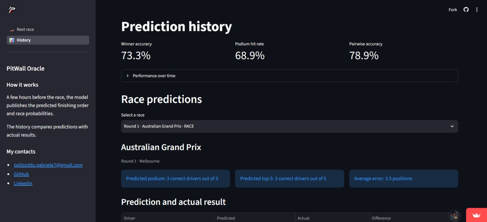

# PitWall Oracle

A machine-learning project, with a custom trained model, that predicts Formula 1 race outcomes before lights out.

PitWall Oracle combines a learning-to-rank model, a separate DNF-probability model, and Monte Carlo simulation to turn pre-race information into predicted finishing orders.

## [Live Demo](https://pitwall-oracle.streamlit.app/)
[](https://pitwall-oracle.streamlit.app/)

## Project Motivation
Formula 1 predictions are often presented as simple driver rankings, even though a race outcome depends on connected uncertainties: driver form, race pace, circuit characteristics, starting position, reliability, and retirements.

I wanted to explore this problem with a real machine-learning system rather than a one-off notebook. The goal is not to claim certainty about a race, but to produce a data-driven forecast before the event and make it accessible through a public web application.

## What It Does
- Predicts the classified finishing order for an upcoming Grand Prix.
- Estimates each driver's probability of a DNF separately from the ranking.
- Simulates many plausible race scenarios with Monte Carlo sampling.
- Publishes predictions and compares them with actual results after a race.
- Provides a Head-to-Head view for comparing two drivers.


## Technical Choices

### Ranking instead of ordinary regression
Finishing position is relative: a driver's result is part of a race-wide ordering. The core model is therefore an `XGBRanker`, trained with one query group per race and evaluated race by race. Gradient-boosted decision trees were chosen because pre-race signals have nonlinear relationships: the value of qualifying pace, recent form, or circuit affinity can change with the team, driver, and track context. The model can learn these interactions without requiring them to be manually specified.

Its ranking objective directly optimises the order within each race rather than the error on independent finishing-position estimates. Native handling of missing values and categorical circuit data also fits a historical motorsport dataset, where information is not always complete or uniformly available. The model uses a fixed, deliberate feature set and is tuned on expanding temporal folds, with early stopping to limit overfitting.

### Separate DNF modelling
A retirement affects the result differently from normal performance variation. PitWall Oracle models DNF probability with a separate logistic-regression model instead of mixing retirements into the ranking target. This is a binary, low-frequency event, so the model is designed to return a calibrated probability rather than a second performance score.

The DNF pipeline median-imputes missing values, standardises the selected features, and fits a regularised logistic regression with class weighting for the minority DNF class. This deliberately compact architecture is easier to calibrate and inspect than a more complex model when the number of retirement examples is limited. Optuna selects the feature subset, regularisation strength, penalty, and class weight on temporal development folds, using Brier score to prioritise probability quality.

### Monte Carlo simulation
The ranker and DNF probabilities are combined in a Monte Carlo simulator. This produces a set of plausible race outcomes rather than only one deterministic classification.

### Causal historical features
Pre-race features use information strictly preceding the target race. Driver and team encodings follow the same temporal rule, preventing current or future results from leaking into a prediction.

### Lightweight product architecture
```text
Historical data (Bronze and Silver layers)
    ↓
Feature engineering (Gold layer)
    ↓
XGBRanker + DNF model (Training and Optimization)
    ↓
Monte Carlo simulation 
    ↓
Validated JSON publication 
    ↓
FastAPI (Vercel) → Streamlit interface
```

The hosted application is read-only: it serves precomputed, validated JSON artifacts rather than training models or fetching race data at request time.

The training of the models and production of JSON files containing the data to display are done inside the GitHub repository, scheduled before and after the race sessions.

## Model Evaluation
The ranker is evaluated on future Grands Prix using expanding temporal folds. Its primary metric is mean race-level pairwise accuracy across the full classified grid. Teammate pairwise accuracy, mean absolute position error, NDCG, and top-k overlap are reported as additional diagnostics.

The DNF model is evaluated separately on future Grands Prix because it solves a probability-estimation problem rather than a ranking problem. Brier score is used as the primary selection metric, measuring the squared error of the predicted probabilities. Log loss is reported alongside it as an additional diagnostic.

Sprint sessions are excluded from the primary model evaluation. Their shorter distance generally reduces exposure to reliability failures, tyre degradation, pit-stop strategy, and other effects that shape a full Grand Prix, but this does not necessarily make every Sprint easier to predict: the format can also be more volatile. The stronger reason for excluding them is that they represent a different race distribution from the project's main prediction target. Mixing Sprint and Grand Prix results would make the headline metrics less representative.
DNF and Monte Carlo evaluation remain intentionally separate from ranker selection.

## Quick Start
Install the project and web-app dependencies in a Python 3.12+ environment:

```powershell
.\venv\Scripts\python.exe -m pip install -r requirements.txt
```

Start the API:

```powershell
.\venv\Scripts\python.exe -m uvicorn webapp.api.app:app --host 127.0.0.1 --port 8000
```

Start the interface:

```powershell
$env:PITWALL_API_URL = "http://127.0.0.1:8000"
.\venv\Scripts\python.exe -m streamlit run webapp\ui\streamlit_app.py
```

For training, simulation, and workflow commands, see [INSTALL_RUN_BUILD.md](INSTALL_RUN_BUILD.md).

## Repository Structure
```text
src/            Model training and simulation
    data/       Data pipeline and feature engineering
    dnf/        Logistic regressor for DNF predictions
    publication/    Scheduling and generation of webapp data files
    ranker/     XGBRanker training and optimization for Race predictions
webapp/         FastAPI API, Streamlit interface, and published JSON artifacts
scripts/        Prediction and post-race automation entry points
models/         Ranker, DNF, and Monte Carlo artifacts
data_files/     Cached datasets and starting-grid data
tests/          Unit and regression tests
exercises/      Exploratory and learning work
```

## What I Learned
- Ranking problems need ranking-aware training and race-level evaluation; a standard regression metric alone does not describe prediction quality.
- Temporal leakage is easy to introduce in sports data and can invalidate an otherwise polished ML workflow.
- Separating performance prediction from failure probability produces a clearer system design and a more meaningful simulation.
- A deployed ML project needs reproducible data contracts, model artifacts, and publication workflows; not only a trained model.
- Product constraints can guide technical choices: Streamlit and FastAPI made it possible to ship a useful interface while keeping the stack focused on Python and data work.

## Current Status and Future Improvements
The core of the project is complete: predictions for every new race will be published a few hours before the race.

Future additions will be:
- Compare PitWall Oracle forecasts with LLM-based and personal predictions.
- Add next-race location, schedule, and countdown to the application.
- Improve Head-to-Head visualisation.
- Evaluate a more customized frontend (probably VUE with full deployment on Vercel) when the product needs it.

## Contact info:
*   **Developer**: Gabriele Polizzotto
*   **Email**: polizzotto.gabriele7@gmail.com
*   **LinkedIn**: [LinkedIn Profile](https://www.linkedin.com/in/gabriele-polizzotto-25376526a/)
